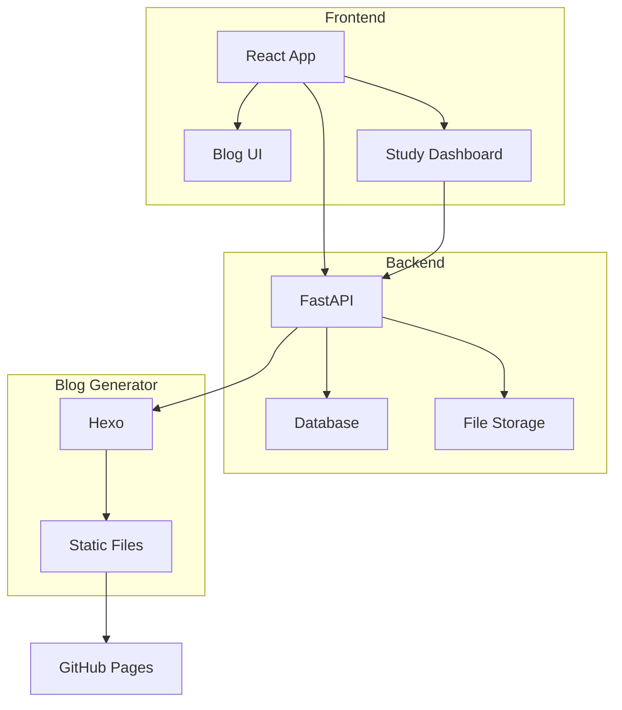

# Personal Blog System

一个支持学习打卡、博客写作的全栈应用系统。同时支持本地开发和一键部署到 GitHub Pages。

## 系统架构 




## 项目结构

```
project-root/
├── frontend/              # React 前端项目
│   ├── src/
│   ├── public/
│   ├── package.json
│   └── README.md
│
├── backend/               # Python 后端项目
│   ├── app/               # 主应用目录
│   │   ├── api/           # API 路由
│   │   ├── models/        # 数据模型
│   │   ├── services/      # 业务逻辑
│   │   └── utils/         # 工具函数
│   ├── tests/             # 测试文件
│   ├── requirements.txt
│   └── README.md
│
├── blog/                  # 博客文章和资源
│   ├── posts/             # Markdown 文章
│   ├── images/            # 文章图片资源
│   └── themes/            # Hexo 主题
│
├── docker/                # Docker 相关配置
│   ├── frontend/
│   │   └── Dockerfile
│   ├── backend/
│   │   └── Dockerfile
│   └── nginx/
│       └── nginx.conf
│
├── scripts/              # 部署和构建脚本
│   ├── deploy-blog.sh    # 部署到 GitHub Pages 的脚本
│   └── build.sh          # 构建脚本
│
├── docker-compose.yml    # Docker Compose 配置
└── README.md             # 项目主文档
```

## 快速开始
### 1. 环境准备
- Node.js 18+
- Python 3.11+
- Docker & Docker Compose
- Git

### 2. 配置环境变量
```bash
cp .env.example .env
# 编辑 .env 文件，填入必要的配置信息
```

### 3. 本地开发
创建后端虚拟环境
```bash
cd backend
python -m venv venv
source venv/bin/activate  # Windows: .\venv\Scripts\activate
pip install -r requirements.txt
```

初始化数据库
```bash
cd backend
source venv/bin/activate  # Windows: .\venv\Scripts\activate
python -m app.db.init_db
```


启动后端开发服务器
```bash
cd backend
source venv/bin/activate  # Windows: .\venv\Scripts\activate
python -m uvicorn app.main:app --reload
```

启动前端开发服务器
```bash
cd frontend
npm install
npm start
```

### 4. Docker 部署
# 构建并启动所有服务
```bash
docker-compose up -d
```

# 查看服务状态
```bash
docker-compose ps
```

# 查看日志
```bash
docker-compose logs -f
```

### 5. 博客部署

安装 Hexo
```bash
npm install -g hexo-cli
```

设置主题
```bash
cd themes
git clone https://github.com/gou7ma7/hexo-theme-next.git
```

创建新文章
```bash
hexo new "my_new_post"
```
注意：推荐使用下划线分割文章名，否则站内跳转可能出现问题

本地预览
```bash
hexo server -g
```

## 主要功能
### 主要功能

#### 学习打卡系统
- 日历视图展示学习记录
- 时间线展示学习进度
- 数据持久化存储

#### 博客系统
- Markdown 文章编辑
- 图片上传和管理
- 文章分类和标签
- 自动部署到 GitHub Pages

### 技术栈
- 前端：React + TypeScript
- 后端：Python (FastAPI)
- 数据库：SQLite/PostgreSQL
- 部署：Docker Compose
- 博客生成：Hexo
- 主题：NexT

### 注意事项
- 本项目仅支持局域网访问
- 需要确保 Docker 环境已正确安装
- 部署到 GitHub Pages 需要配置相应的 GitHub Token
- 图片资源统一存放在 `blog/images` 目录下
- 请确保 `.env` 文件中的敏感信息不被提交到版本控制系统

### 常见问题
- 如遇到权限问题，请检查文件权限设置
- 部署失败时，检查 GitHub Token 是否正确配置
- 图片上传失败，检查存储目录权限
- Docker 构建失败，检查 Docker 配置和网络连接

### 贡献指南
1. Fork 本仓库
2. 创建特性分支
3. 提交更改
4. 发起 Pull Request

### License
MIT
